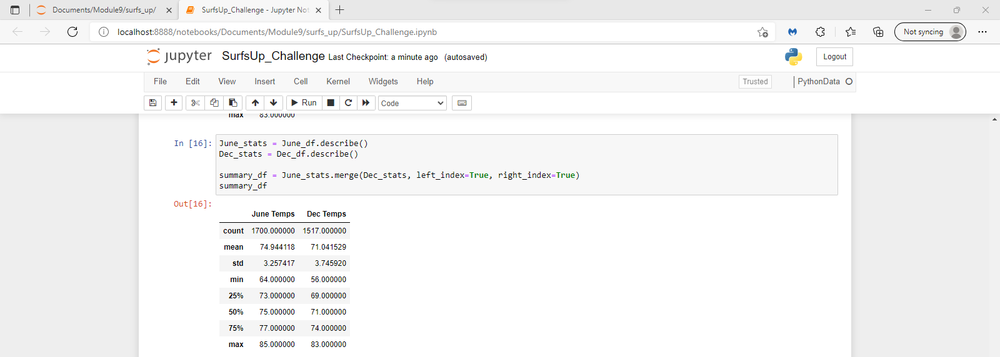
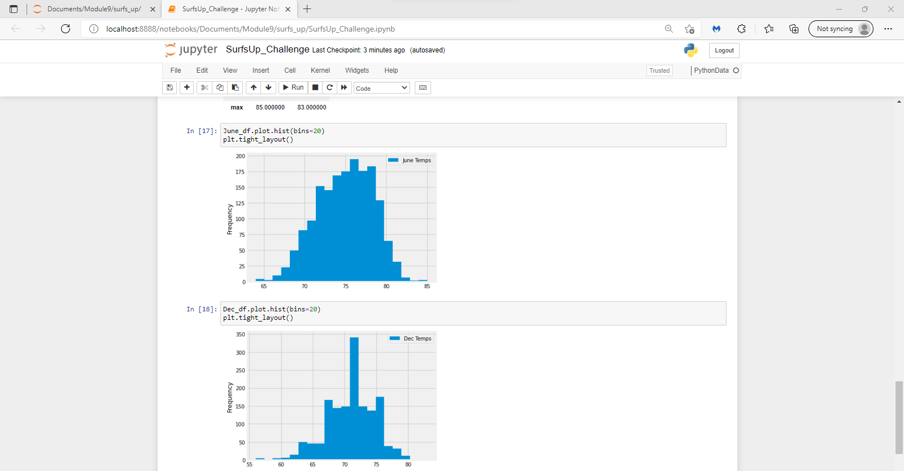

# surfs_up

## Overview of the Analysis

The purpose of the exercise was to use the knowledge we have gained throughout Module 9 and be able to apply it in order to extract the Hawaii temperature data for the months of June and December in Oahu. 

The average recorded temperature in June is about 75 degrees fahrenheit, four degrees higher than the average temperature in December.
This represents a decrease of 5.3% in average temperature in June versus December.

The frequency of temperatures recorded in June tends to be more normal, confirmed by the smaller Standard Deviation Measure of June temperatures vs December temperatures.
The December temperatures appear to vary more than those in June given the larger range in recorded temperatures (comparing the Max vs Min temp in each month).

When reviewing the December Temperatures, we see that the median temperature in December is consistent with the average. There are not many outliers altering the average temperature higher or lower than the actual recorded frequency.

##Summary

#In conclusion although December temperatures seem to vary more than those of June it still would provide appropriate weather conditions for both surfing and seem to have a demand for ice cream purchases. 
The average temperatures in June and December differ by only 4 degrees. From the December histogram, we can see its median temperature, with the highest frequency recorded across a span of years, is about 72 degrees.

Overall the weather in June and December are historically similar. Oahu seems to be a great location for the surf and ice cream shop to thrive for both the owner, investors, and customers. 

